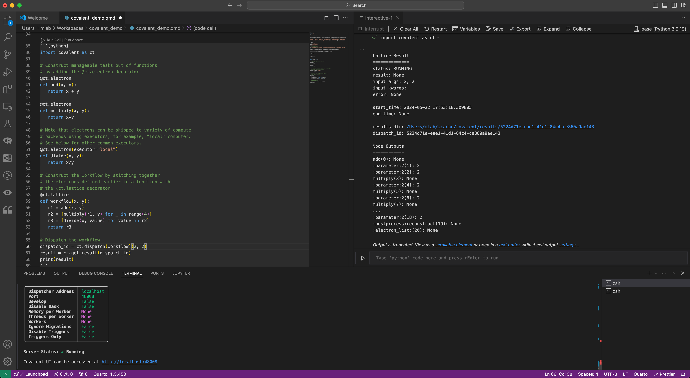
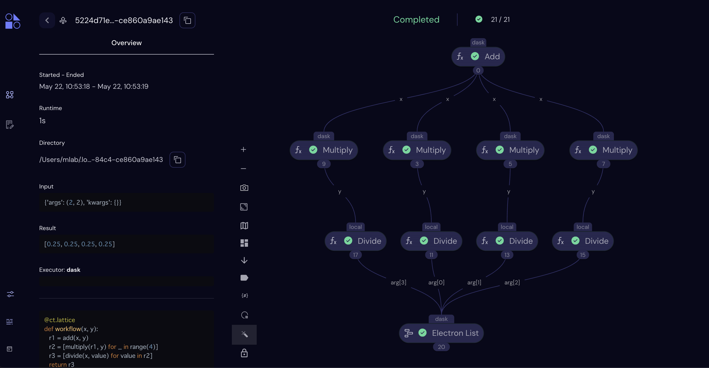
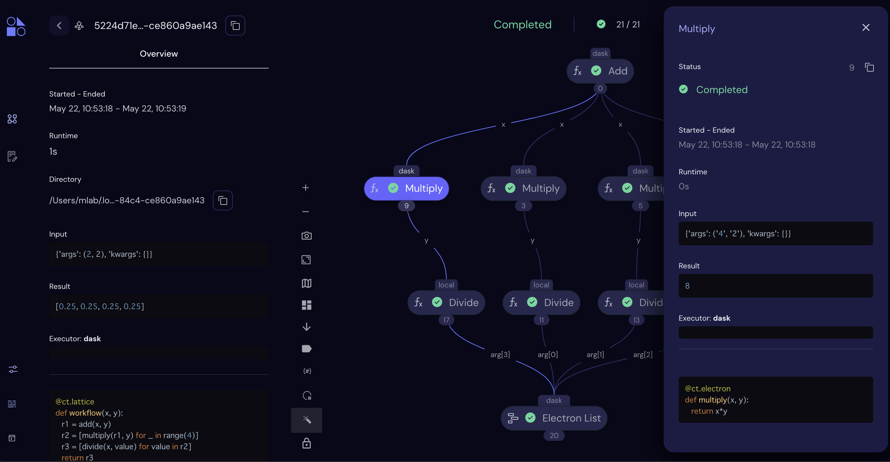

```{mermaid}
flowchart LR
    id1[Goal/Intent] --> id2[Goal Contraint Network]
    id2 --> id4[state affects diagram]
    id4 --> id3[state dictionary]
    id4 --> id5[Governing Equation]
    id5 --> id6[Define Modules]
    id6 --> id7[DSM / N2 Matrix]
    id3 --> id7
    id7 -.-> id6
    id7 --> id8[Code Module]
    id8 --> id9[Integrate Module]
    id8 --> id10[Test Module]
    id10 -.-> id5
    id10 --> id9
    id9 --> id11[Benchmark]
    id11 -.-> id8
    id11 -.-> id5
    id11 --> id12[Deploy]


```